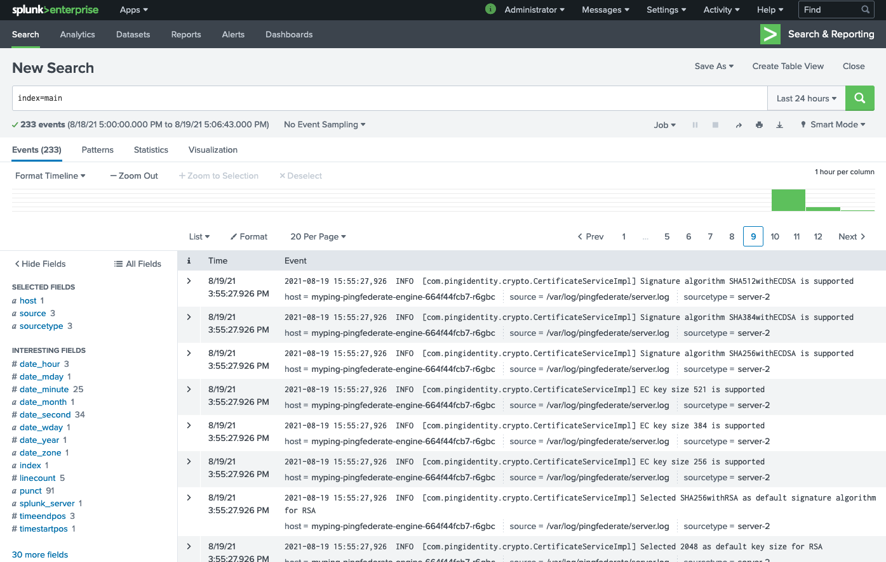
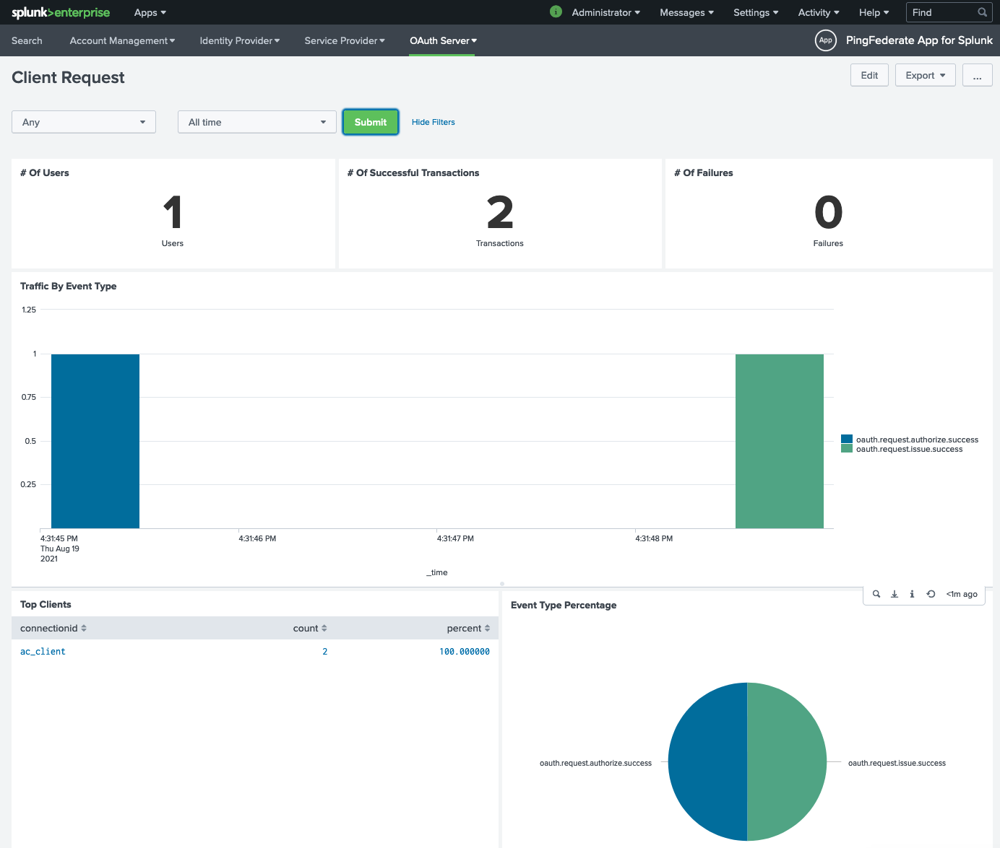

# Capturing Logs and Metrics using Splunk

In this example, you'll forward PingFederate, PingAccess and PingDirectory logs and metrics to Splunk.

## Before you begin

You must:

* Complete [Get Started](../get-started/getStarted.md) to set up your DevOps environment and run a test deployment of the products
* Create or have access to a Kubernetes cluster
* Create a Kubernetes secret using your DevOps credentials. For more information, see [Using your DevOps user and key](../get-started/devopsUserKey.md#for-kubernetes)
* Add the Ping Identity Helm [repo](https://helm.pingidentity.com/)
    * Helm chart version 0.6.4 or greater

Optional:

* Ingress: The supplied ingress deployment yaml may not work in all environments and will need modification (hostname, type etc) to function properly within your cluster.

## Deployed Components

* PingIdentity
    * PingFederate
    * PingAccess
    * PingDirectory
* Splunk
    * Splunk deployment
    * Splunk Universal Forwarder
* Optional
    * Ingress

## References

This example was created using the follow resource documentation

* [PingFederate Logs formatting for Splunk](https://docs.pingidentity.com/bundle/pingfederate-103/page/qst1564002981075.html)
* [PingFederate Dashboard reference](https://docs.pingidentity.com/bundle/pingfederate-100/page/cmn1580335292058.html)
* [Splunk Universal Forwarder in Kubernetes](https://computingforgeeks.com/send-logs-to-splunk-using-splunk-forwarder/)
* [Logging in Kubernetes Using Splunk](https://faun.pub/logging-in-kubernetes-using-splunk-c2785948fdc0)

## About this task

You will:

* Deploy Splunk Enterprise
* Create configs in Splunk
* Create and use an HTTP Event Collector (HEC) token
* Create a ConfigMap that contains Splunk Universal Forwarder (UF) configuration
* Deploy PingFederate, PingAccess, and PingDirectory using Helm with Splunk's Universal Forwarder (UF) as a Sidecar

## Deploying the example

!!! note "Deployment files"
    Source deployment files are located in Ping Identity's DevOps Getting Started [repo](https://github.com/pingidentity/pingidentity-devops-getting-started/tree/master/20-kubernetes/15-splunk-metrics/)

1. Deploy Splunk using the provided YAML file

    ```sh
    kubectl apply -f splunk/splunk.yaml
    ```

1. **(Optional)** Add Ingress to Splunk deployment. To add the ingress, modify the `splunk/ingress.yaml` file with your host, tls and Ingress annotations. Once updated, apply.

    ```sh
    kubectl apply -f splunk/ingress.yaml
    ```

1. In your Browser, navigate to your deployed instance of Splunk
    - Create an index named `pinglogs` (settings->indexes)
    - Create an HTTP Event Collector named `pinglogs` (settings->data inputs)
        - Copy the HEC token as it will be required later
    - Install the PingDirectory, PingFederate and PingAccess Splunk applications (apps->find more apps)
        - Note: you will need a valid login to Splunk. Register [here](https://www.splunk.com/view/SP-CAAAABD) for a free account

1. Update then deploy the `splunk/splunk-config-init.yaml` file with your HEC token from the previous step

    ```yaml
    Example:
    ...
    [httpout]
    httpEventCollectorToken = c3538a15-f58d-2034-ef2d-76422828e03f
    ...
    ```

    ```sh
    kubectl apply -f splunk/splunk-config-init.yaml
    ```

1. Deploy the Ping Identity products and Splunk Universal Forwarder sidecars using the supplied Helm `values.yaml` file

    !!! note "Ingress Configuration"
        Ingress is enabled within the `values.yaml` file. Specify your Ingress settings or disabled by editing the file

    !!! note "Sever Profiles Information"
        * Ping products using
            * baseline profile
            * Splunk logs profile layer (log4j2.xml config)

    ```sh
    helm \
      upgrade --install \
      splunk-example \
      pingidentity/ping-devops \
      -f values.yaml
    ```

1. Once the services are up and running you should start to see product logs available in Splunk

    

1. To produce metrics for the installed applications, generate traffic.
    - PingFederate: Use the engine's OAuthPlayground
    - PingAccess: Use the `/anything` endpoint to login (user.0 / 2FederateM0re)
    - PingDirectory: Use the searchrate, modrate and authrate tools within the pod

    
